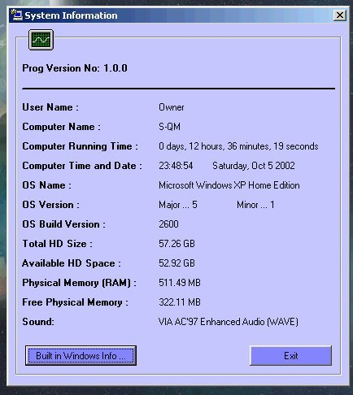



## OS Version etc\.

### Description

Sabastian Mares recent post prompted me to do this and I thought it might be useful to a few people.

It is taken from one of my projects so therefore, is not particularly well commented

but hopefully you can pick your way through it.

It works on all OS but I have discovered a bug on certain system builds. I would be interested if everything works Ok on yours.

There is an ocx which you may need to register.
 
### More Info
 
OCX may need registering.

             |
---                |---
**Submitted On**   |2002-01-10 11:08:14
**By**             |[Stu\.](https://github.com/Planet-Source-Code/PSCIndex/blob/master/ByAuthor/stu.md)
**Level**          |Intermediate
**User Rating**    |5.0 (10 globes from 2 users)
**Compatibility**  |VB 6\.0
**Category**       |[Custom Controls/ Forms/  Menus](https://github.com/Planet-Source-Code/PSCIndex/blob/master/ByCategory/custom-controls-forms-menus__1-4.md)
**World**          |[Visual Basic](https://github.com/Planet-Source-Code/PSCIndex/blob/master/ByWorld/visual-basic.md)
**Archive File**   |[OS\_Version1412131052002\.zip](https://github.com/Planet-Source-Code/stu-os-version-etc__1-39567/archive/master.zip)

### API Declarations

Various

